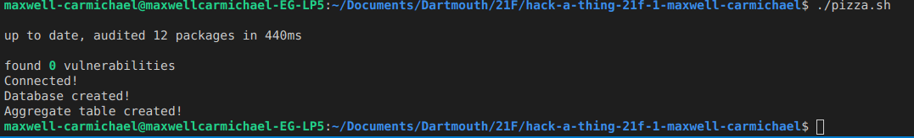
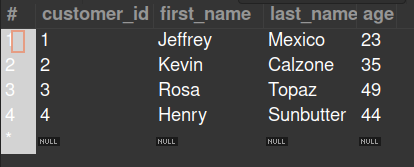
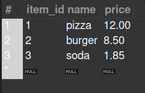
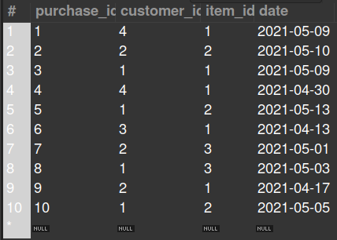
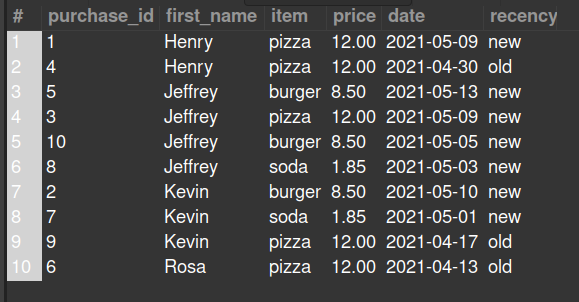

# Hack Technology / Project Attempted

## What you built? 

I attempted to build a small program which did something with MySQL. I've frequently heard about the popularity of SQL and have seen relational databases as a desired skill on many job postings and thought it would be a useful skill to have that could also apply to a plethora of projects. My initial plan was to have a CLI where a user could order food and pick it up and I would store order and price information in the database, but learning MySQL took much longer than I anticipated, and creating a Node.js CLI was much harder than I thought. 

So what I ended up building was a simple program which would create a database with three tables, then aggregate the tables using JOIN and UNION into a fourth table. The program needs to have a MySQL instance running and the tables can be accessed via MySQL Workbench or another UI. Though pretty minimal, I am happy with my program because I had not written a line of SQL before this small project, and now I can create and manipulate my own tables in a javascript program without the need to copy each line of code from stack overflow.

**Program execution output:**

**customers table:**

This table was filled with information using INSERT.

**items table:**

This table was filled with information using INSERT.

**purchases table:**

This table was filled with information using INSERT.

**aggregate table:**

This table was created by running a `CREATE TABLE ... AS` statement and using a `SELECT` subquery to `JOIN` columns of all three tables, effectively replacing 'customer_id' and 'item_id' of the purchases table with the customer's first name and the item's name. I also use a `UNION` statement to add an extra column which features how recent the purchase was - "new" meaning past May 1, 2021 and "old" meaning before May 1, 2021. It is ordered by customer name (alphabetical ascending) and date (descending).

## How to run

You need to have MySQL downloaded in order to run. I highly recommend using MySQL Workbench too if you are unfamiliar with MySQL, downloaded here: https://dev.mysql.com/downloads/workbench/. From the Workbench, you can create a localhost instance of a MySQL, and then add that port, username (user), and password to the mysqlconfig.json file.

Once you have a MySQL server running with the exact info in mysqlconfig.json, you can run `./pizza.sh` (may need to `chmod +x pizza.sh`) and this will create a database "pizzaparlor" with four tables that can be viewed from the Workbench or your prefered means of using MySQL. 

## Who Did What?

I worked alone, so I went through the entire process of learning MySQL, learning how to incorporate it with a Node.js program, and writing the SQL statements to create & join tables.

## What you learned

The biggest thing I learned was MySQL. I've never dealt with relational databases before, only NoSQL, so the majority of my time (4+ hours) was spent just learning MySQL, from `SELECT` statements to more complex concepts like multiple `Primary Keys`, using `UNION` to add classifier columns, using `SELECT` subqueries to feed necessary information into outer queries, and the many different types of `JOIN`s. In addition to what I coded in this repo, I also spent time writing many SQL statements while following the tutorial in order to get my hands dirty before attempting to write my own program. A last thing that I had to spend time figuring out was the precise syntactic order that MySQL demands - `ORDER BY` after `WHERE`, `JOIN` before `WHERE`, etc.

Another thing I learned was how to introduce MySQL into a Node.js application. Although the tutorial on how to do so was relatively straightforward as I already had experience with npm and node modules, I ran into a new issue in which the MySQL API favors callback statements, which can be very annoying as complicated procedures can produce "callback hell" if the developer is not careful. I figured out how to create my own Promises in javascript in order to keep my code from looking like complete spaghetti, and I think pizza.js is a lot cleaner because of it.

## Authors

Maxwell Carmichael - maxwell.j.carmichael.22@darmouth.edu 

## Acknowledgments

YouTube tutorial by Programming With Mosh on learning MySQL and MySQL Workbench:
https://www.youtube.com/watch?v=7S_tz1z_5bA&ab_channel=ProgrammingwithMosh

W3 schools tutorial on incorporating MySQL in Node.js:
https://www.w3schools.com/nodejs/nodejs_mysql.asp